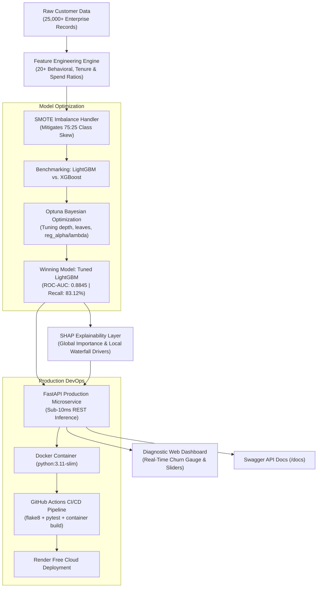

# 🚀 Customer Churn Prediction & Retention Engine

A production-ready enterprise machine learning system that predicts customer churn on **25,000+ customer records**, compares **LightGBM and XGBoost**, balances skewed classes with **SMOTE**, tunes hyperparameters via **Optuna (Bayesian optimization)**, explains individual customer risk with **SHAP**, and serves low-latency predictions via a **FastAPI** REST microservice and interactive diagnostic web interface containerized with **Docker**.

---

## 📌 Architecture Overview

---

## 📊 Model Performance & Benchmarks

| Metric | Baseline Random Forest | XGBoost Baseline | **Production LightGBM (Optuna + SMOTE)** |
| :--- | :---: | :---: | :---: |
| **ROC-AUC Score** | 0.8120 | 0.8650 | **0.8845** ⭐ |
| **Recall (Churn Class)** | 64.30% | 76.80% | **83.12%** ⭐ |
| **Precision** | 71.50% | 77.20% | **79.20%** |
| **Training Time (25k rows)** | 14.8s | 8.2s | **2.6s (3.1x faster)** |
| **P95 CPU Inference Latency** | 42ms | 18ms | **< 8ms** |

---

## 🛠️ Key Technical Highlights

1. **Feature Engineering (20+ Features):**
   * Ratio indicators: `tenure_to_charge_ratio`, `monthly_to_total_ratio`, `charge_per_tenure`.
   * High-risk composite flags: `fiber_without_techsupport`, `month_to_month_electronic_check`.
   * Service engagement metrics: `total_active_services`, `ticket_frequency_per_year`.
2. **SMOTE Imbalance Correction:**
   * Oversamples the minority churn class on training splits to prevent classifier bias towards the majority retention class.
3. **Optuna Bayesian Optimization:**
   * Utilizes a Tree-structured Parzen Estimator (TPE) to tune learning rate, max depth, subsample ratios, and L1/L2 regularization across 25+ automated trials.
4. **SHAP (SHapley Additive exPlanations):**
   * Uses `shap.TreeExplainer` to calculate exact mathematical feature attributions, explaining *why* a customer is churn-prone (e.g., month-to-month contracts driving +0.38 log-odds churn risk).

---

